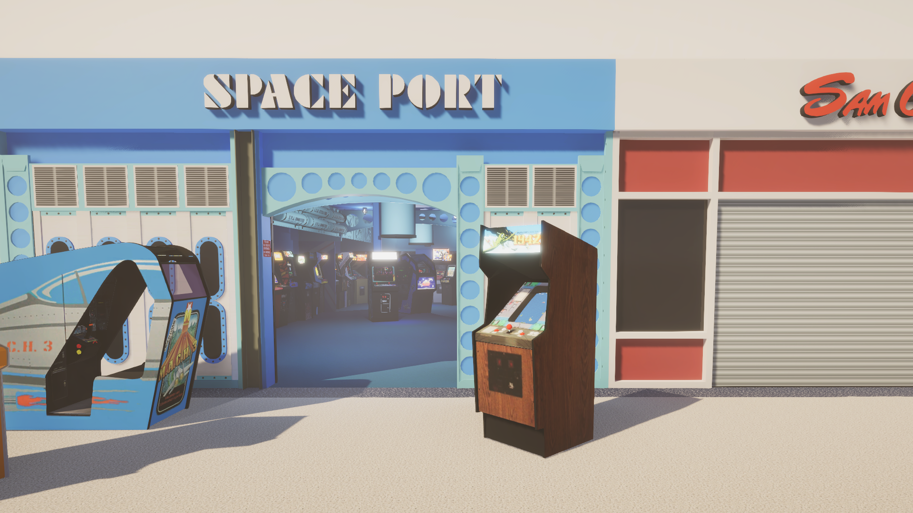
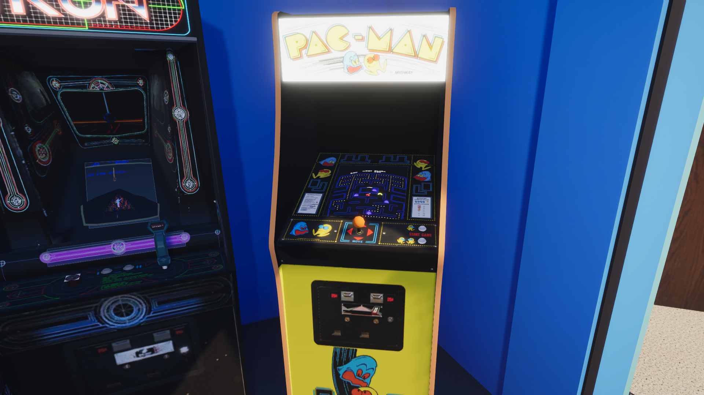

# 3DArcade
An Emulation Frontend in virtual spaces, malls, arcades, bedrooms, anything is possible...

It can run games directly on 3D models using cores from Libretro. It also supports launching arbitrary external executables with arguments (the output won't show on models, this simply starts applications normally).

# Links:
- [3DArcade Website](https://www.mameworld.info/3darcade/index.html)
- [3DArcade Forum](https://3darcade.000webhostapp.com/)
- [Libretro wrapper](https://github.com/Skurdt/SK.Libretro)
